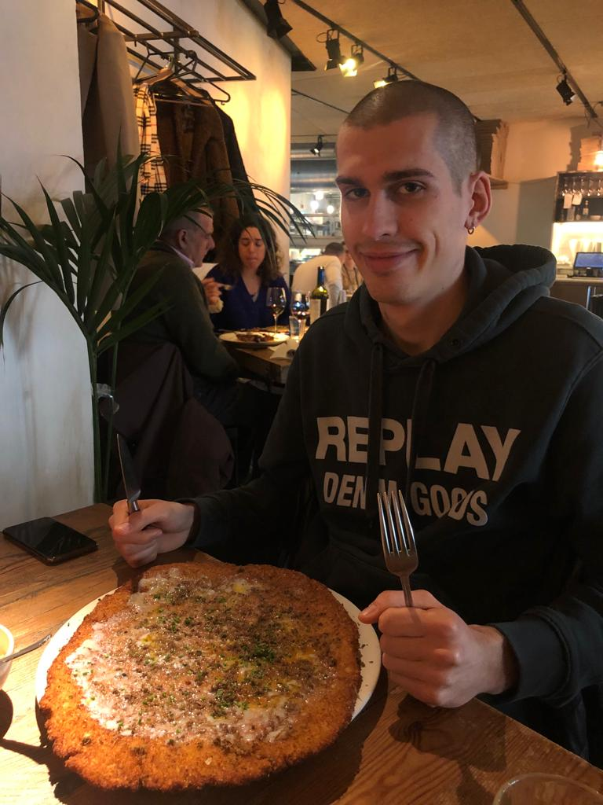

# Pedro Juan Royo's website

::::{grid} 1 2 3 3 
:class-container: text-center 
:gutter: 3

:::{grid-item-card} 
:link: cv 
:link-type: doc 
:margin: 4 2 auto auto

Curriculum 📝
^^^

Check my CV online!
:::

:::{grid-item-card} 
:link: projects
:link-type: doc 
:margin: 4 2 auto auto

Projects 🔨
^^^

Check some projects I have done (can't promise it'll be good tho 😐)
:::

:::{grid-item-card} 
:link: contact
:link-type: doc 
:margin: 4 2 auto auto

Contact me 📨
^^^

Do you want to get in contact with me?
:::
::::

Heyo, this is my website! It has a record of everything worth recording that I've done, which is not much for now but hopefully that will change soon 🤡.

Some random facts about me (in no particular order):

- I like to code but I am not too good at it.
- I do not see the point in anyone ever using Windows as an operating system. Too bad not all apps can run on Linux...
- I love cats 😼.
- I live to eat, not the other way around. I'm very proud of my lump free bechamel 🤤!
- I love CLI and TUI programs and try to do as many things as possible in them (I am writing this document using the *Helix* editor, *Zellij* as a terminal multiplexer and I listen to music using *termusic*).
- Tiling window managers rule! (i3wm for the win 😁)
- I have watched *The Office (US)* more than 10 times, and this number can only go up 😎.

::::{grid} 1 2 2 2
:gutter: 3
:margin: 4 4 0 0

:::{grid-item}

:::

:::{grid-item}
*Me eating a giant schnitzel - sometime in 2022*
:::
::::
